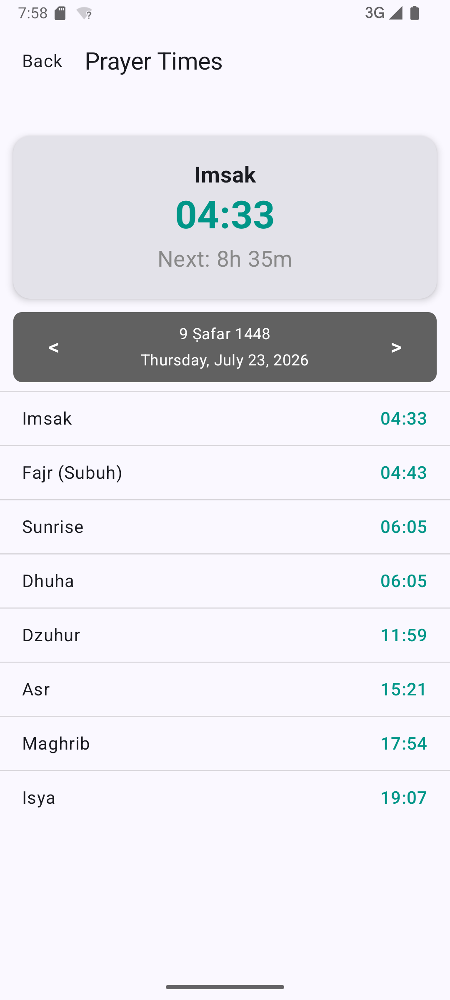
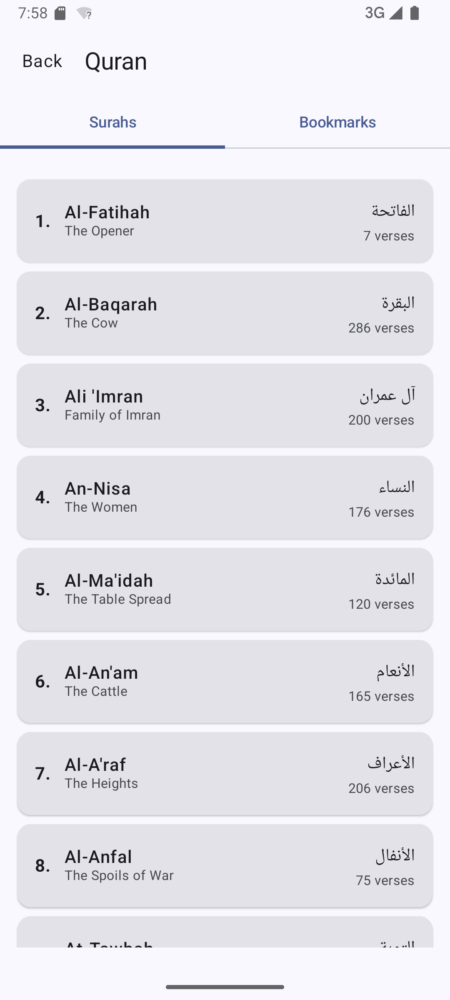
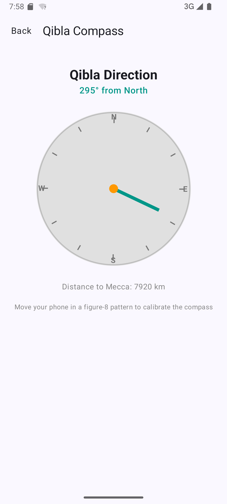
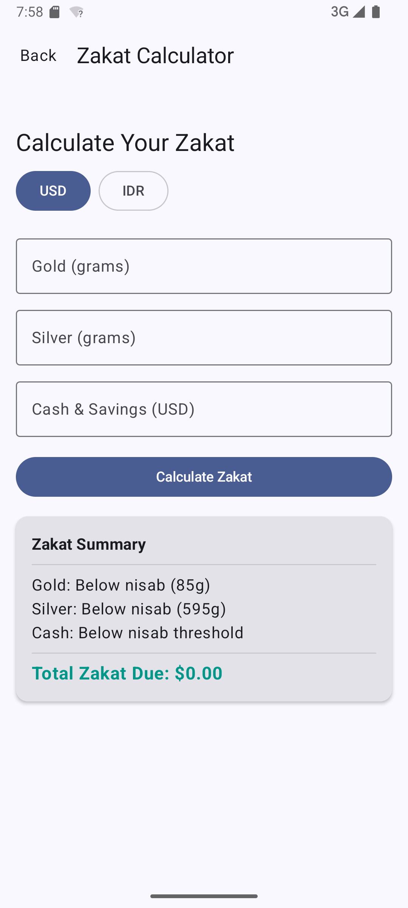
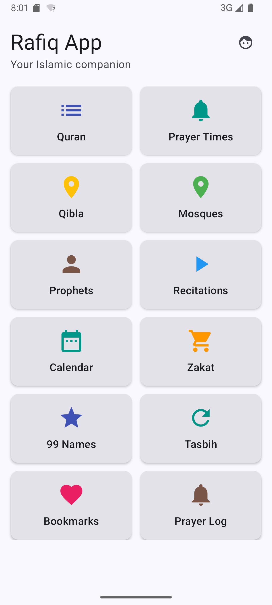

# 🕌 Rafiq - Islamic Lifestyle App for Android

<p align="center">
  <a href="https://github.com/smiledev/rafiq-android/actions/workflows/pr-check.yml"></a>
  <a href="https://github.com/smiledev/rafiq-android/actions/workflows/release.yml"></a>
  <a href="https://kotlinlang.org"></a>
  <a href="https://developer.android.com/about/versions/marshmallow"></a>
  <a href="https://developer.android.com/jetpack/compose"></a>
  <a href="https://dagger.dev/hilt/"></a>
</p>

<p align="center">
<b>Rafiq</b> demonstrates modern Android development with Kotlin, Jetpack Compose (Material3), Coroutines, Flow, Hilt, Navigation3, Room, and WorkManager based on <b>MVVM Architecture</b> and <b>Clean Architecture</b> multi-module guidelines.
</p>

---

## 📥 Download

Go to the [Releases](https://github.com/smiledev/rafiq-android/releases) section to download the latest APK.

---

## 📸 Screenshots

| Dashboard | Prayer Times | Quran Reader | Qibla Compass |
| :---: | :---: | :---: | :---: |
|  |  |  |  |

| Zakat Calculator | 99 Names of Allah | Tasbih Counter | Nearby Mosques |
| :---: | :---: | :---: | :---: |
|  |  |  |  |

---

## 🌟 Key Features

| Feature | Description |
|---|---|
| **🕌 Prayer Times** | Real-time prayer calculation via Aladhan API with date navigation and countdown timer. |
| **📖 Quran & Recitations** | 114 Surahs with Arabic text, translations, sajdah markers, and audio stream (15 reciters via Media3). |
| **🧭 Qibla Compass** | Live compass bearing calculation pointing towards Mecca with distance display. |
| **✨ 99 Names of Allah** | Complete list with Arabic typography, transliterations, meanings, and search functionality. |
| **📅 Islamic Calendar** | Hijri dates, upcoming Islamic events, and detailed month selector. |
| **📜 Prophet Stories** | Biographies and details of 25 Prophets of Islam with instant search. |
| **💰 Zakat Calculator** | Real-time gold and silver spot prices conversion via Metals.live API with asset Nisab threshold logic. |
| **📿 Tasbih Counter** | Digital zikr counter with haptic feedback and target goals. |
| **🗺️ Nearby Mosques** | Offline-capable OpenStreetMap location view using OsmDroid. |
| **🔖 Bookmarked Verses** | Bookmark favorite verses saved locally in Room database. |
| **📊 Prayer Tracker** | Daily prayer log screen with toggle switches to track daily worship. |
| **🔔 Notifications** | Background prayer alarm notifications scheduled via WorkManager. |

---

## 🛠️ Tech Stack & Open-Source Libraries

### Architecture & Core
- **[Kotlin](https://kotlinlang.org/)** (2.0.0): Modern, expressive, and concise programming language.
- **[Coroutines](https://github.com/Kotlin/kotlinx.coroutines)** + **[Flow](https://kotlin.github.io/kotlinx.coroutines/kotlinx-coroutines-core/kotlinx.coroutines.flow/)**: Asynchronous and reactive programming streams.
- **[Hilt](https://dagger.dev/hilt/)** (2.56.2): Standard dependency injection library for Android (KAPT).
- **[Navigation3](https://developer.android.com/guide/navigation)**: Type-safe Compose navigation using Kotlin `@Serializable` data tokens.
- **MVVM Architecture + Repository Pattern**: Separation of concerns between UI, Domain, and Data layers.

### UI & Styling
- **[Jetpack Compose](https://developer.android.com/jetpack/compose)**: Modern declarative UI toolkit.
- **[Material Design 3](https://m3.material.io/)**: Modern design system, dynamic color schemes, and Islamic color palette.
- **Custom Typography**: Arabic font support via `FontFamily(Font(R.font.me_quran))`.

### Data & Local Storage
- **[Room Database](https://developer.android.com/training/data-storage/room)** (2.8.4): SQLite object mapping library for offline prayer logs, bookmarks, and translation databases.
- **[DataStore Preferences](https://developer.android.com/topic/libraries/architecture/datastore)**: Type-safe key-value data storage for user preferences.

### Network & Media
- **[Retrofit2](https://github.com/square/retrofit) & Gson**: Type-safe REST client for fetching Prayer Times and Metal spot prices.
- **[Media3 ExoPlayer](https://developer.android.com/guide/topics/media/media3)**: Audio playback engine for streaming recitations.
- **[OsmDroid](https://github.com/osmdroid/osmdroid)** (6.1.18): OpenStreetMap integration for locating nearby mosques.
- **[WorkManager](https://developer.android.com/topic/libraries/architecture/workmanager)**: Deferrable background task management for notifications.

---

## 🏗️ Architecture & Modularization

Rafiq follows **Clean Architecture** and Google's recommended [Guide to app architecture](https://developer.android.com/topic/architecture) with a **Multi-Module** layout.

### Multi-Module Structure

```
rafiq-android/
├── :app          # Application module (UI screens, ViewModels, Hilt DI, Services, Navigation3)
├── :data         # Data layer (Room DAOs, Databases, Retrofit APIs, DataStore, Repository Impls)
├── :domain       # Domain layer (Repository interfaces, Use cases, Domain models)
└── :core         # Core utilities (Result pattern, AppError, DispatcherProvider, DatabaseCopier)
```

### Layer Architecture Overview

```mermaid
graph TD
```mermaid
graph TD
    subgraph UI ["UI Layer (:app)"]
        UI_Screen["Jetpack Compose Screens"]
        UI_VM["Hilt ViewModels"]
        UI_Screen -->|"Observe UI State"| UI_VM
        UI_VM -->|"Emit Intent / User Events"| UI_Screen
    end

    subgraph Domain ["Domain Layer (:domain)"]
        Domain_UC["Use Cases"]
        Domain_Model["Domain Models"]
        Domain_Repo["Repository Interfaces"]
        UI_VM -->|"Executes"| Domain_UC
        Domain_UC -->|"Invokes"| Domain_Repo
    end

    subgraph Data ["Data Layer (:data)"]
        Data_RepoImpl["Repository Implementations"]
        Data_Room["Room Local Databases"]
        Data_Retrofit["Retrofit Remote APIs"]
        Data_Store["DataStore Preferences"]

        Domain_Repo -.->|"implements"| Data_RepoImpl
        Data_RepoImpl --> Data_Room
        Data_RepoImpl --> Data_Retrofit
        Data_RepoImpl --> Data_Store
    end

    subgraph Core ["Core Layer (:core)"]
        Core_Utils["Result&lt;T&gt;, AppError, DispatcherProvider"]
    end

    UI --> Core
    Domain --> Core
    Data --> Core
```

### Architecture Highlights
- **Offline-First**: Bundled SQLite database assets (`quran-uthmani.db` and translation databases) ensure complete offline Quran reading without requiring an initial network load.
- **Single Source of Truth**: Repositories in `:data` manage caching between remote REST APIs (Aladhan, Metals.live) and local databases.
- **Unidirectional Data Flow (UDF)**: ViewModels expose immutable `StateFlow<UiState>` to Compose UI elements while handling events asynchronously via Coroutines.

---

## 🌐 Data Sources & APIs

- **Quran Text & Translation**: Bundled SQLite database (`quran-uthmani.db` & `translations/*.db`) via `DatabaseCopier`.
- **Prayer Timings API**: [Aladhan REST API](https://aladhan.com/prayer-times-api) (`v1/timings/{date}`).
- **Zakat Gold/Silver Spot Prices**: [Metals.live API](https://metals.live/) (`v1/spot/gold`, `v1/spot/silver`).
- **Maps**: OpenStreetMap tile provider managed via `OsmDroid`.

---

## 🚀 Building & Setup

### Prerequisites
- **Android Studio** Ladybug (2024.2+) or newer
- **JDK**: 17+
- **Android SDK**: 36 (minSdk 23, targetSdk 36)
- **Environment**: Set `JAVA_HOME` pointing to JDK / Android Studio JBR.

### Build APK

```powershell
# Set JAVA_HOME (Windows PowerShell example)
$env:JAVA_HOME = "C:\Program Files\Android\Android Studio\jbr"

# Build debug APK
.\gradlew assembleDebug
```

The compiled APK will be located at:
`app/build/outputs/apk/debug/app-debug.apk`

### Running Unit Tests

```powershell
.\gradlew testDebug
```

---

## 📄 License

```
Copyright 2026 Rafiq Android Team

Licensed under the Apache License, Version 2.0 (the "License");
you may not use this file except in compliance with the License.
You may obtain a copy of the License at

    http://www.apache.org/licenses/LICENSE-2.0

Unless required by applicable law or agreed to in writing, software
distributed under the License is distributed on an "AS IS" BASIS,
WITHOUT WARRANTIES OR CONDITIONS OF ANY KIND, either express or implied.
See the License for the specific language governing permissions and limitations under the License.
```


