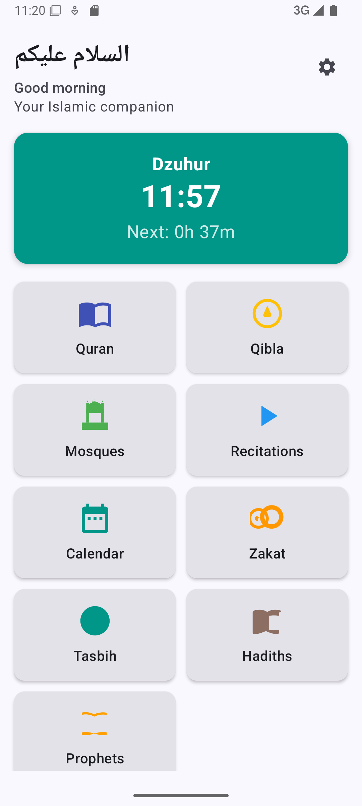
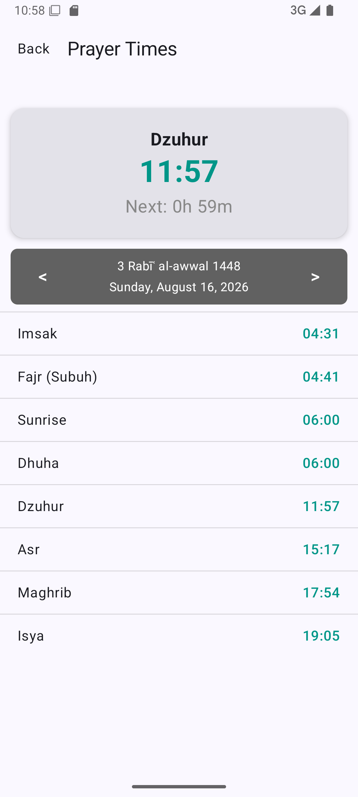
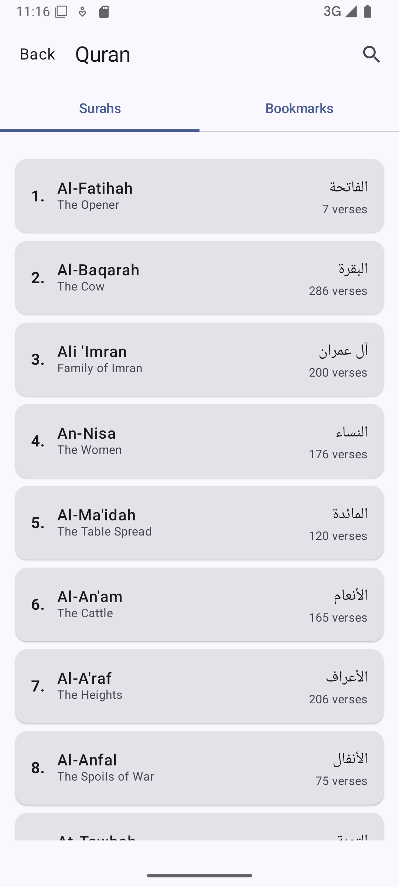
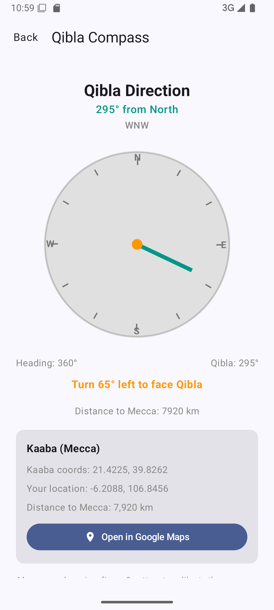
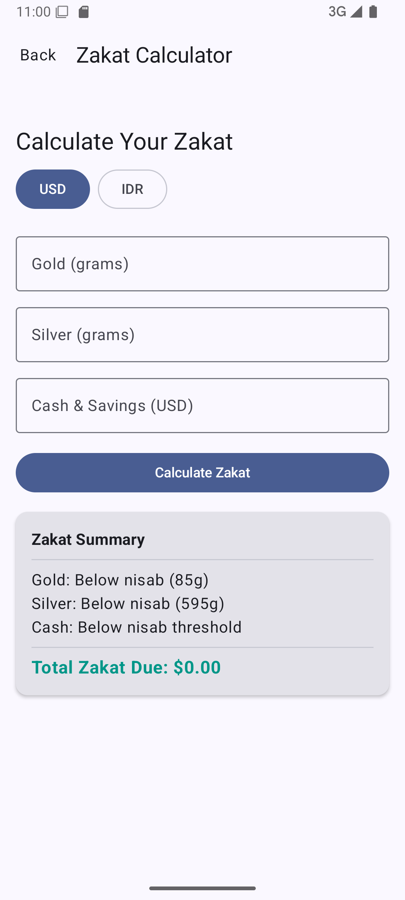
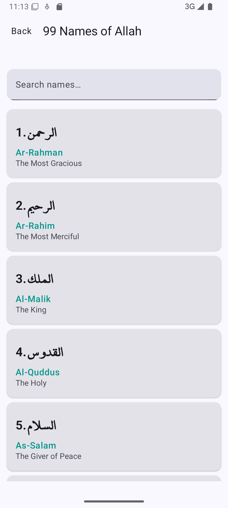
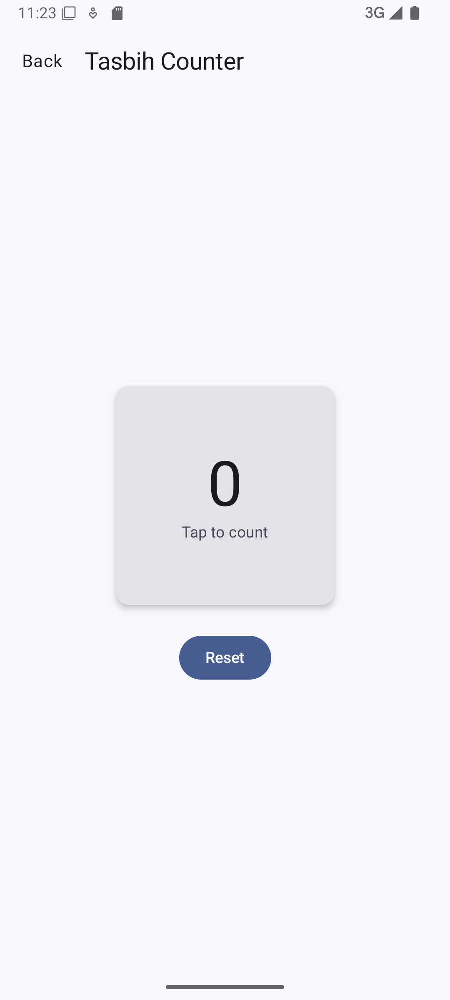
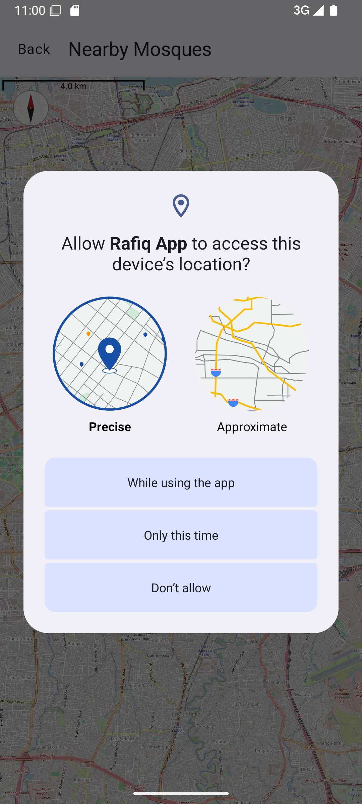
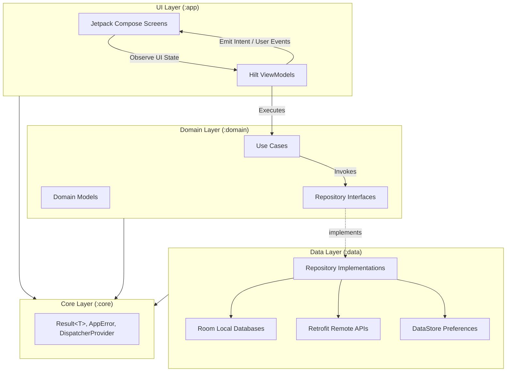

# 🕌 Rafiq - Islamic Lifestyle App for Android

<p align="center">
  <a href="https://github.com/suryamudti/rafiq-android/actions/workflows/pr-check.yml"></a>
  <a href="https://github.com/suryamudti/rafiq-android/actions/workflows/release.yml"></a>
  <a href="https://kotlinlang.org"></a>
  <a href="https://developer.android.com/about/versions/marshmallow"></a>
  <a href="https://developer.android.com/jetpack/compose"></a>
  <a href="https://dagger.dev/hilt/"></a>
</p>

<p align="center">
<b>Rafiq</b> demonstrates modern Android development with Kotlin, Jetpack Compose (Material3), Coroutines, Flow, Hilt, Navigation3, Room, and WorkManager based on <b>MVVM Architecture</b> and <b>Clean Architecture</b> multi-module guidelines.
</p>

---

## 📥 Download

Go to the [Releases](https://github.com/suryamudti/rafiq-android/releases) section to download the latest APK.

---

## 📸 Screenshots

| Dashboard | Prayer Times | Quran Reader | Qibla Compass |
| :---: | :---: | :---: | :---: |
|  |  |  |  |

| Zakat Calculator | 99 Names of Allah | Tasbih Counter | Nearby Mosques |
| :---: | :---: | :---: | :---: |
|  |  |  |  |

---

## 🌟 Key Features

| Feature | Description |
|---|---|
| **🕌 Prayer Times** | Real-time prayer calculation via Aladhan API with date navigation and countdown timer. |
| **📖 Quran & Tafsir** | 114 Surahs with Uthmani Arabic text, Indonesian/English translations, per-ayah tafsir, sajdah markers, and memorization mode. |
| **🔊 Recitations** | Audio streaming of 15 reciters via Media3 ExoPlayer with background playback. |
| **🧭 Qibla Compass** | 16-point direction name, live heading/bearing readout, turn left/right offset indicator (proximity within 5°), Kaaba info card, and a Google Maps button. |
| **✨ 99 Names of Allah** | Complete list with Arabic typography, transliterations, meanings, and search functionality. |
| **📅 Islamic Calendar** | Tabular Hijri dates, monthly grid with event/fasting dots, day sheet, upcoming observances (57 events), and sunnah fasting recommendations. |
| **📜 Prophet Stories** | Biographies of 25 Prophets with facts, key events, lessons, and verse references; Arabic/Latin search, favorites filter, share, adjustable story font size, and prev/next navigation. |
| **💰 Zakat Calculator** | Nisab threshold logic with instant results computed locally while gold/silver prices refresh in the background from the Metals.live API (in-memory cache). |
| **📿 Tasbih Counter** | Digital zikr counter with haptic feedback and target goals. |
| **🗺️ Nearby Mosques** | Location-aware OpenStreetMap view (OsmDroid) with nearby mosque discovery via a reliable Overpass POST API with mirror failover. |
| **🔖 Bookmarked Verses** | Bookmark favorite verses saved locally in Room database. |
| **📊 Prayer Tracker** | Daily prayer log screen with toggle switches to track daily worship. |
| **🔔 Notifications** | Background prayer alarm notifications scheduled via WorkManager. |
| **⚙️ Settings** | Language preference (Bahasa Indonesia / English) and user preferences stored in DataStore. |

---

## 🛠️ Tech Stack & Open-Source Libraries

### Architecture & Core
- **[Kotlin](https://kotlinlang.org/)** (2.0.0): Modern, expressive, and concise programming language.
- **[Coroutines](https://github.com/Kotlin/kotlinx.coroutines)** + **[Flow](https://kotlin.github.io/kotlinx.coroutines/kotlinx-coroutines-core/kotlinx.coroutines.flow/)**: Asynchronous and reactive programming streams.
- **[Hilt](https://dagger.dev/hilt/)** (2.56.2): Standard dependency injection library for Android (KAPT).
- **[Navigation3](https://developer.android.com/guide/navigation)**: Type-safe Compose navigation using Kotlin `@Serializable` data tokens.
- **MVVM Architecture + Repository Pattern**: Separation of concerns between UI, Domain, and Data layers.

### UI & Styling
- **[Jetpack Compose](https://developer.android.com/jetpack/compose)**: Modern declarative UI toolkit.
- **[Material Design 3](https://m3.material.io/)**: Modern design system, dynamic color schemes, and Islamic color palette.
- **Custom Typography**: Arabic font support via `FontFamily(Font(R.font.me_quran))`.

### Data & Local Storage
- **[Room Database](https://developer.android.com/training/data-storage/room)** (2.8.4): SQLite object mapping library for offline prayer logs, bookmarks, and translation databases.
- **[DataStore Preferences](https://developer.android.com/topic/libraries/architecture/datastore)**: Type-safe key-value data storage for user preferences.

### Network & Media
- **[Retrofit2](https://github.com/square/retrofit) & Gson**: Type-safe REST clients for Prayer Times, Tafsir (EQuran/IslamicApp), Metal spot prices, and Overpass mosque queries.
- **[OkHttp](https://square.github.io/okhttp/)**: HTTP client with logging interceptor.
- **[Media3 ExoPlayer](https://developer.android.com/guide/topics/media/media3)**: Audio playback engine for streaming recitations.
- **[Google Play Services Location](https://developers.google.com/android/reference/com/google/android/gms/location/package-summary)**: Fused location provider for nearby mosques.
- **[OsmDroid](https://github.com/osmdroid/osmdroid)** (6.1.18): OpenStreetMap integration for locating nearby mosques.
- **[WorkManager](https://developer.android.com/topic/libraries/architecture/workmanager)**: Deferrable background task management for notifications.

---

## 🏗️ Architecture & Modularization

Rafiq follows **Clean Architecture** and Google's recommended [Guide to app architecture](https://developer.android.com/topic/architecture) with a **Multi-Module** layout.

### Multi-Module Structure

```
rafiq-android/
├── :app          # Application module (UI screens, ViewModels, Hilt DI, Services, Navigation3)
├── :data         # Data layer (Room DAOs, Databases, Retrofit APIs, DataStore, Repository Impls)
├── :domain       # Domain layer (Repository interfaces, Use cases, Domain models)
└── :core         # Core utilities (Result pattern, AppError, DispatcherProvider, DatabaseCopier)
```

### Layer Architecture Overview


```mermaid
graph TD
    subgraph UI ["UI Layer (:app)"]
        UI_Screen["Jetpack Compose Screens"]
        UI_VM["Hilt ViewModels"]
        UI_Screen -->|"Observe UI State"| UI_VM
        UI_VM -->|"Emit Intent / User Events"| UI_Screen
    end

    subgraph Domain ["Domain Layer (:domain)"]
        Domain_UC["Use Cases"]
        Domain_Model["Domain Models"]
        Domain_Repo["Repository Interfaces"]
        UI_VM -->|"Executes"| Domain_UC
        Domain_UC -->|"Invokes"| Domain_Repo
    end

    subgraph Data ["Data Layer (:data)"]
        Data_RepoImpl["Repository Implementations"]
        Data_Room["Room Local Databases"]
        Data_Retrofit["Retrofit Remote APIs"]
        Data_Store["DataStore Preferences"]

        Domain_Repo -.->|"implements"| Data_RepoImpl
        Data_RepoImpl --> Data_Room
        Data_RepoImpl --> Data_Retrofit
        Data_RepoImpl --> Data_Store
    end

    subgraph Core ["Core Layer (:core)"]
        Core_Utils["Result&lt;T&gt;, AppError, DispatcherProvider"]
    end

    UI --> Core
    Domain --> Core
    Data --> Core
```

### Architecture Highlights
- **Offline-First**: Bundled SQLite database assets (`quran-uthmani.db` and translation databases) ensure complete offline Quran reading without requiring an initial network load.
- **Single Source of Truth**: Repositories in `:data` manage caching between remote REST APIs (Aladhan, Metals.live) and local databases.
- **Unidirectional Data Flow (UDF)**: ViewModels expose immutable `StateFlow<UiState>` to Compose UI elements while handling events asynchronously via Coroutines.

---

## 🌐 Data Sources & APIs

- **Quran Text & Translation**: Bundled SQLite databases (`quran-uthmani.db`, `translations/en.sahih.db`, `translations/id.indonesian.db`) via `DatabaseCopier`.
- **Tafsir**: [EQuran.id API](https://equran.id/) (`api/v2/tafsir/{surah}`) for Indonesian tafsir and [IslamicApp API](https://api.islamic.app/) (`v1/verses/by_key/{sura}:{aya}`) for English tafsir (Ibn Kathir).
- **Prayer Timings API**: [Aladhan REST API](https://aladhan.com/prayer-times-api) (`v1/timings/{date}`).
- **Zakat Gold/Silver Spot Prices**: [Metals.live API](https://metals.live/) (`v1/spot/gold`, `v1/spot/silver`).
- **Nearby Mosques**: [Overpass API](https://overpass-api.de/) (POST query body) with mirror failover across `overpass-api.de`, `overpass.kumi.systems`, and `maps.mail.ru`.
- **Maps**: OpenStreetMap tile provider managed via `OsmDroid`.
- **Static Content**: JSON assets for 99 Names, Islamic events, prophets, dzikir/tasbih, reciters, chapters, and juz metadata.

---

## 🚀 Building & Setup

### Prerequisites
- **Android Studio** Ladybug (2024.2+) or newer
- **JDK**: 17+
- **Android SDK**: 36 (minSdk 23, targetSdk 36)
- **Environment**: Set `JAVA_HOME` pointing to JDK / Android Studio JBR.

### Build APK

```powershell
# Set JAVA_HOME (Windows PowerShell example)
$env:JAVA_HOME = "C:\Program Files\Android\Android Studio\jbr"

# Build debug APK
.\gradlew assembleDebug
```

The compiled APK will be located at:
`app/build/outputs/apk/debug/app-debug.apk`

Install on the emulator:

```powershell
adb -s emulator-5554 install -r app\build\outputs\apk\debug\app-debug.apk
```

### Running Tests

```powershell
.\gradlew testDebug                 # unit tests (JVM)
.\gradlew connectedDebugAndroidTest # instrumented tests (emulator required)
```

---

## 📄 License

```
Copyright 2026 Rafiq Android Team

Licensed under the Apache License, Version 2.0 (the "License");
you may not use this file except in compliance with the License.
You may obtain a copy of the License at

    http://www.apache.org/licenses/LICENSE-2.0

Unless required by applicable law or agreed to in writing, software
distributed under the License is distributed on an "AS IS" BASIS,
WITHOUT WARRANTIES OR CONDITIONS OF ANY KIND, either express or implied.
See the License for the specific language governing permissions and limitations under the License.
```


